# 🏪 편할래 - 편의점 행사 정보와 편의점 레시피를 편하게!

## 편할래 링크   [https://pnale.online/]

## 프로젝트 진행 기간

2023.08.21(월) ~ 2023.10.06(금)
 
SSAFY 9기 2학기 특화 프로젝트

 

## 편할래 - 배경

편하게 편의점 행사 정보를 받고 싶다면?  
편의점 상품으로 만든 맛있는 레시피를 알고 싶다면?  
편의점 행사 정보를 쉽게 볼 수 있고 자신만의 레시피를 공유할 수 있는 편할래가 있습니다.

 

## 편할래 - 개요

**편할래**는 현재 진행중인 편의점 행사와 편의점 레시피를 편하게 확인할 수 있는 서비스 입니다.

 편할래에서는 세븐일레븐, 이마트24, CU, GS25 4개의 편의점에서 진행하고 있는 행사를 쉽게 확인할 수 있습니다. 

또한, 행사 중인 물품들을 사용해서 만든 편의점 레시피를 사람들에게 공유하고 원하는 상품으로도 교체하여 경제적으로 맛있는 한 끼를 먹을 수 있습니다.

편할래에서 행사 중인 상품들을 모아 보고 관심을 등록하여 알림으로도 행사정보를 받아보세요.

## 주요 기능

## 편의점 행사

- 편의점 별 행사 진행중인 상품을 모아볼 수 있습니다.
- 좋아하는 상품을 관심 등록하여 상품이 행사가 진행하면 메일로 행사 정보를 받아볼 수 있습니다.
- 많은 이용자에게 관심을 받고 있는 베스트 상품을 확인할 수 있습니다.

## 편의점 레시피

- 사용자들이 올린 편의점 상품을 이용한 레시피를 볼 수 있습니다.
  - 현재 편의점 행사나 본인 취향에 맞춰 레시피 재료를 변경할 수 있습니다.
  - 레시피 재료들의 가격과 총 가격을 볼 수 있습니다.
- 자신만의 편의점 레시피를 만들어 게시할 수 있습니다.
  - 좋아하는 레시피를 올려 공유할 수 있습니다.
  - 편의점 상품을 이용해서 레시피와 조리 방법을 올릴 수 있습니다.
  - 행사 정보를 통해 가성비 있는 레시피를 만들 수 있습니다.
     

## 마이 페이지(유저 페이지)

- 등록한 레시피와 관심 등록한 레시피를 확인할 수 있습니다.
- 관심등록한 상품들을 볼 수 있습니다.
   

## ✔ 주요 기술

**Backend - Springboot**

- IntelliJ
- MySQL DB
- Spring Boot
- OAuth API (kakao, google)
- JPA
- Spring Security

**Backend - Data**

- Redis
- Elastic Search
- Kibana
- Selenium

**Frontend**

- Node(18.X.X) LTS
- Vite : 4.4.5
- axios: 1.5.0
- react: 18.2.0
- react-dom: 18.2.0
- react-modal: 3.16.1
- react-query: 3.39.3
- react-quill: 2.0.0
- react-router-dom: 6.15.0
- react-slick: 0.29.0
- react-toastify: 9.1.3
- recoil: 0.7.7
- recoil-persist: 5.1.0
- slick-carousel: 1.8.1
- styled-components: 6.0.7
- postcss: 8.4.29
- tailwind-styled-components: 2.2.0
- tailwindcss: 3.3.3

**Environment**

- AWS EC2
- NGINX
- SSL
- Docker
- Jenkins

## ✔ 협업 툴

---

- Gitlab
- Notion
- JIRA
- MatterMost
- POSTMan
- Canva

## ✔ 협업 환경

- Gitlab
  - 코드 버전 관리
  - 이슈 발행, 해결을 위한 토론
  - MR시, 팀원이 코드리뷰를 진행하고 피드백 게시
- JIRA
  - 매주 목표량을 설정하여 Sprint 진행
  - 업무의 할당량을 정하여 Story Point를 설정하고, In-Progress -> Done 순으로 작업
  - 소멸 차트를 통해 프로젝트 진행도 확인
- 회의
  - 각자 위치에서 건네야 할 말이 생기면 팀원의 위치로 이동하여 전달
  - 빠른 소통과 신속한 대응 가능
- Notion

  - 회의가 있을때마다 회의록을 기록하여 보관
  - 회의가 길어지지 않도록 다음날 제시할 안건을 미리 기록
  - 기술확보 시, 다른 팀원들도 추후 따라할 수 있도록 보기 쉽게 작업 순서대로 정리
  - 컨벤션 정리
  - 간트차트 관리
  - 스토리보드, 스퀀스다이어그램, 기능명세서 등 모두가 공유해야 하는 문서 관리

- POSTMan
  - POSTMan 이용해 필요한 API 테스트 및 실행
  - API 변동 사항을 한눈에 볼 수 있으며, 인수 또는 반환값 스키마를 제공

## ✔ 팀원 역할 분배

## 👪 팀 소개

|                         |                     |                   |
| :--------------------------------------------------------------: | :---------------------------------------------------------: | :--------------------------------------------------------: |
| [이현욱](https://github.com/Devwooki) 팀장 : BE 개발 및 배포 | [여현빈](https://github.com/godzz733)   BE 개발 및 분산 | [이세훈](http://github.com/Kimzegal)   BE 개발 및 분산 |
|                         |                    |                   |
|       [김효인](https://github.com/kimnioyh)   FE 개발        |    [정현모](https://github.com/wjdgusaho)   FE 개발     | [김동민](https://github.com/DongMinE)   FE 개발 및 UCC |

  

<!-- 자유 양식 -->

## 프로젝트 상세 설명

개발 환경, 기술 스택, 시스템 구성도, ERD, 기능 상세 설명 등

## ✔ **Git 커밋 메시지 컨벤션**

- `feat` 새로운 기능 추가, 기존의 기능을 요구 사항에 맞게 수정
- `fix` 기능에 대한 버그 수정
- `refactor` 기능 변화 X - 코드 리팩터링
- `build` 빌드 관련 수정
- `chore` 패키지 매니저 수정 , 그 외 기타 수정 ( gitignore )
- `ci` CI 관련 설정 수정
- `style` 코드 스타일 , 포맷팅에 대한 수정
- `test` 테스트 코드 추가 / 수정
- `release` 버전 릴리즈
- `docs` 문서 (주석) 수정
- `set :` 프로젝트(레포지토리) 설정
- 커밋 타입은 **대문자**로 시작하며, 항상 대괄호 안에 파트를 입력하여 시작
- 관련된 지라 이슈 번호에 괄호를 붙여 뒤에 추가.

 

## ✔ **Git 브랜치 컨벤션**

- `Front`
  - 빌드 가능한 상태의 Front-end 브랜치
- `Back`
  - 빌드 가능한 상태의 Back-end 브랜치
- `feat`
  - 개별 기능 구현 브랜치
  - 기능 개발 완료 시 삭제
  - 네이밍 규칙
    - Front/feature or Back/기능이름
    - 예) Back/feature/login
        
- **feature 브랜치가 완성되면 각각 Front / Back 브랜치로 merge request를 통해 merge한다.** 
  ⇒ merge request가 요청되면, 모든 팀원들이 코드 리뷰를 하여 안전하게 merge한다.

 

## ✔ 프로젝트 산출물

---

- [기획서](https://www.notion.so/wookdev/a4817b317fec41d7b3145c12db29594a)
- [기능명세서 및 요구사항 명세서](https://www.notion.so/wookdev/0b0068b3558e4707b5cfa61c8484f26f)
- [아키텍처](docs/architecture.png)
- [와이어프레임](https://www.figma.com/file/4f5flfh8bIRC8h17hfnsBo/%EC%B6%94%EC%96%B5%EC%9D%80%EB%B0%A9%EC%9A%B8%EB%B0%A9%EC%9A%B8?type=design&mode=design&t=xFGaJaNvTdCmWUt5-0)
- [API](https://www.notion.so/wookdev/API-3f0d1b3efb4f42ee8f9f3a15c7d3f83f)
- [ERD](docs/erd.png)

## 포팅 메뉴얼

- [포팅메뉴얼](https://www.notion.so/wookdev/84233dfb29ac4625951c03a0bb0140da)

## ✔ 프로젝트 결과물

- [최종발표자료](https://www.canva.com/design/DAFuSAwmcBg/6TRUTwLbOtqo5dgfr892-A/edit)

## 🎵 NeighBrew 서비스 화면

### 로그인

 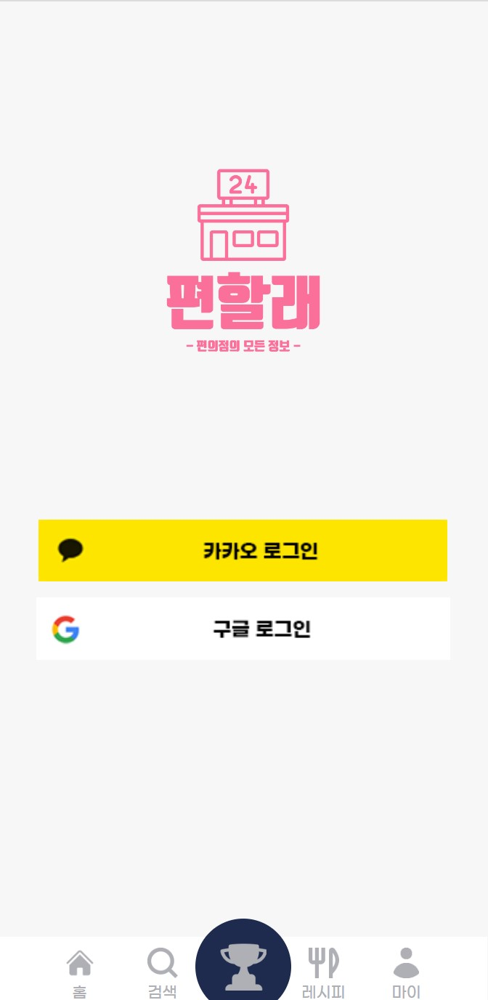

### 메인화면

 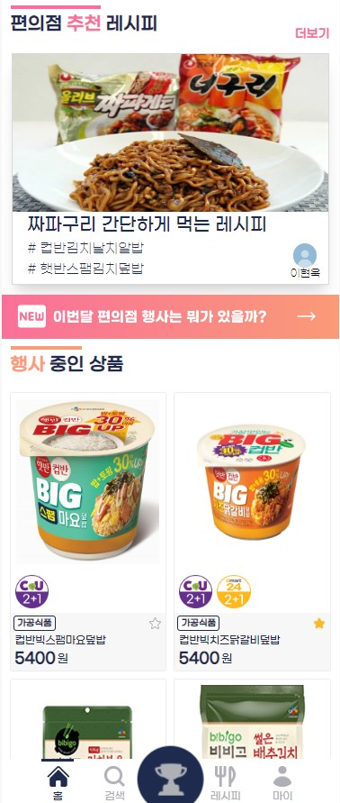

### 상품 검색

 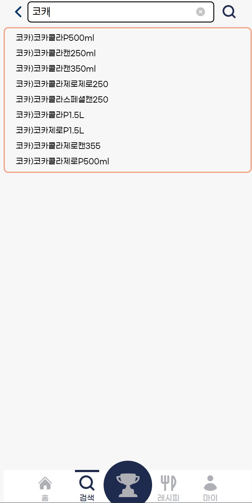
 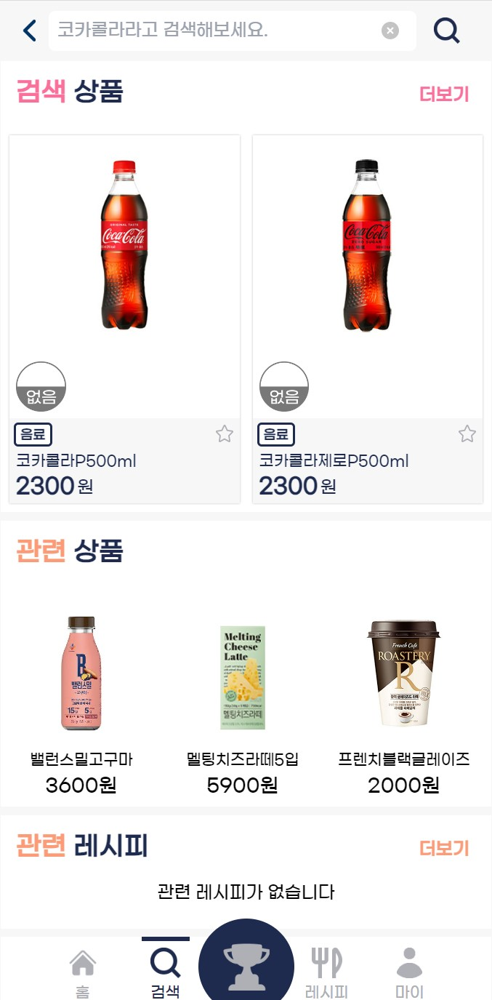

### 편의점 별 페이지

 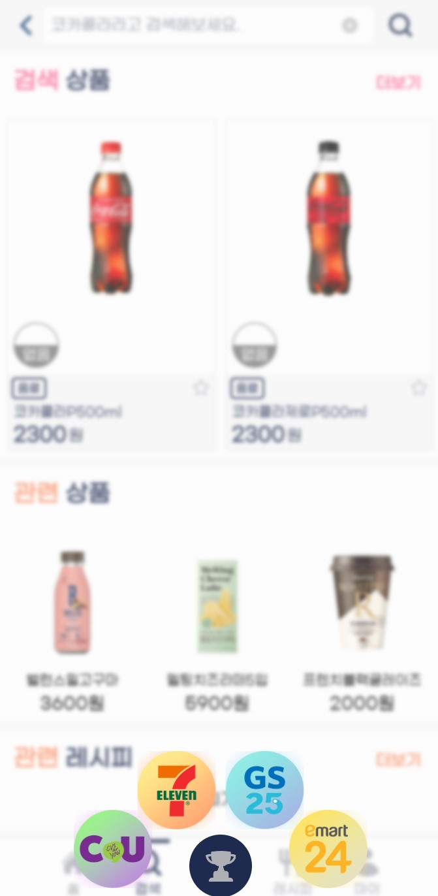
 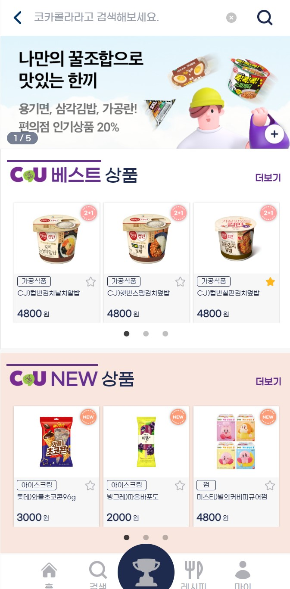
 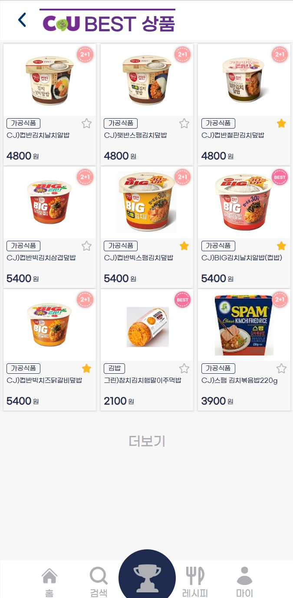
 

### 레시피

 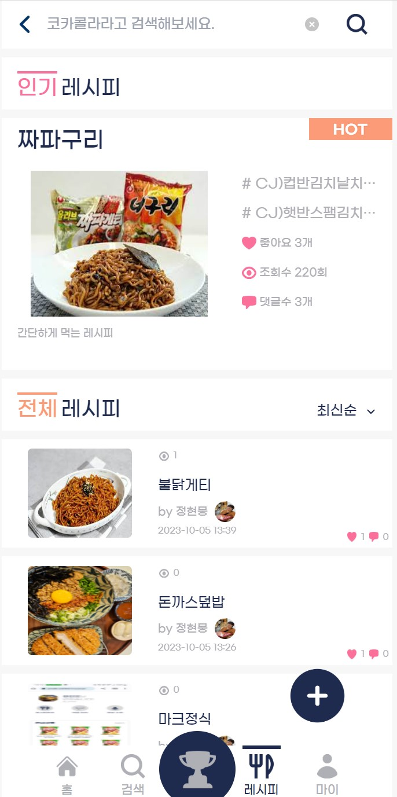
 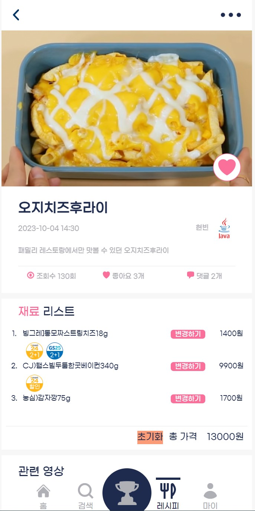

### 마이페이지

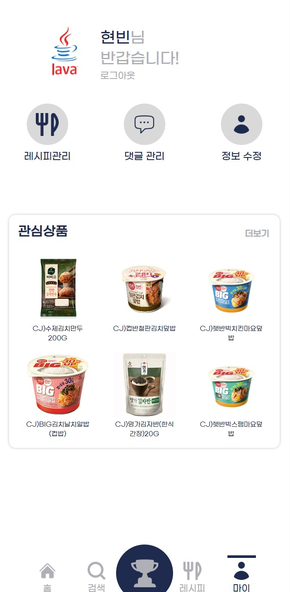
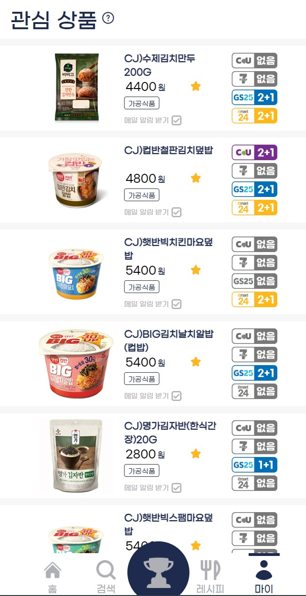
